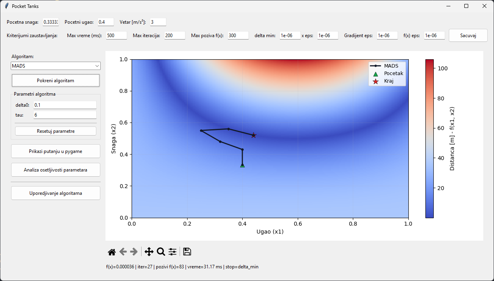
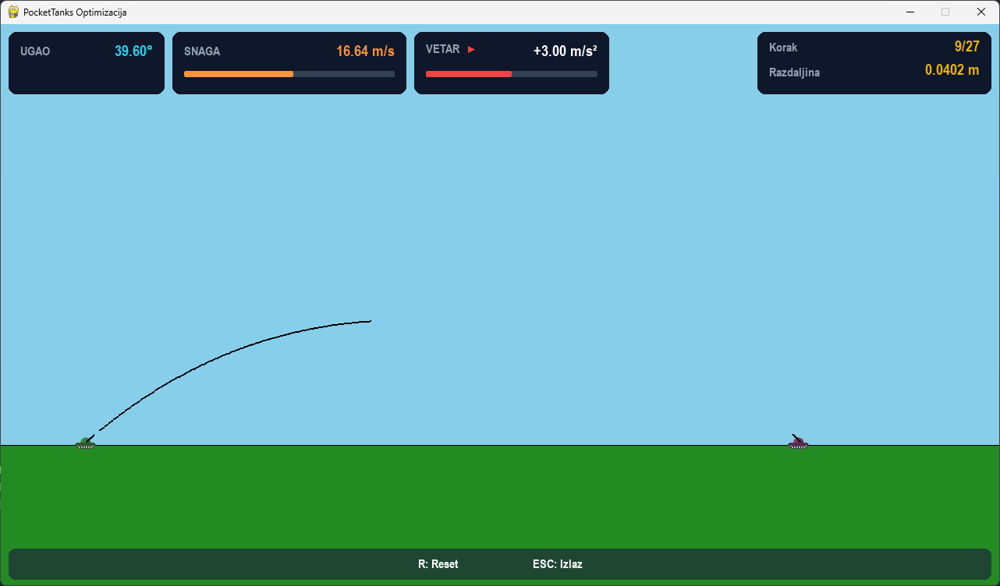
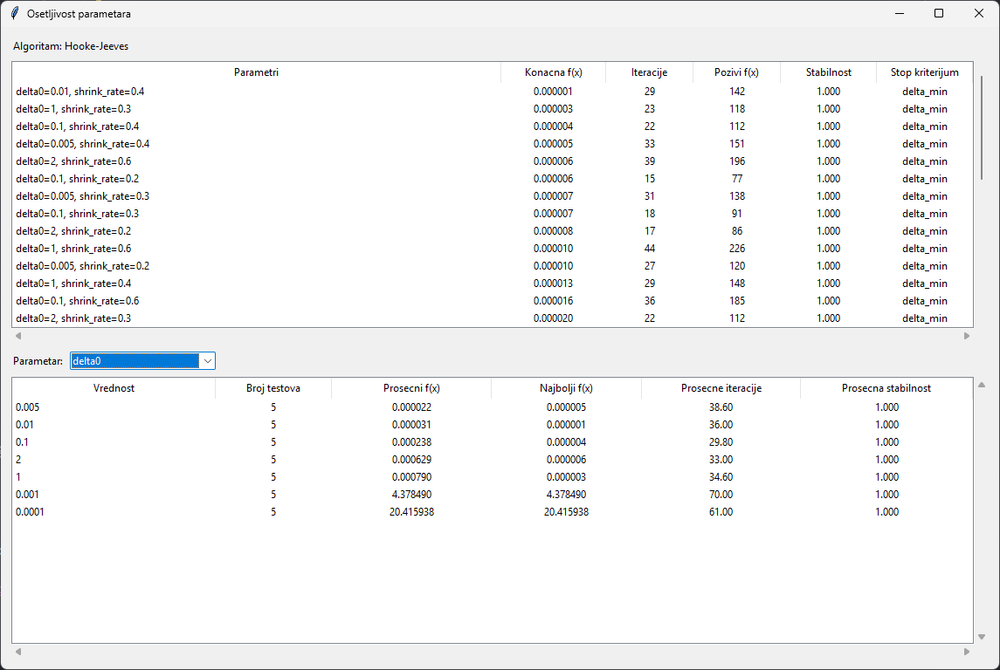
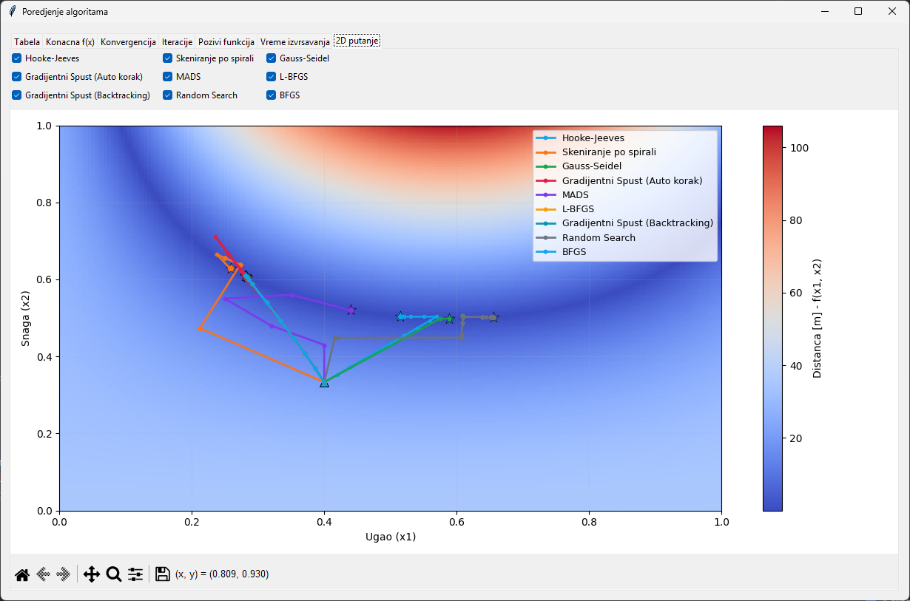

# Pocket Tanks Numerical Optimization

Project for the course Optimization Algorithms in Machine Learning

## Project Description

This project implements optimization of a function that simulates projectile behavior in a game similar to Pocket Tanks.
The goal is to optimize the angle and power of the shot so that the projectile hits the target with minimal error,
taking into account the effects of gravity, wind, and terrain.

### Mathematical Model

The function simulates the projectile trajectory through an iterative scheme:

- $v_x^0 = p \cos \theta$
- $v_y^0 = -p \sin \theta$
- $v_x^{k+1} = v_x^k + \omega \Delta t$
- $v_y^{k+1} = v_y^k + g \Delta t$
- $x^{k+1} = x^k + v_x^{k+1}\, s \Delta t$
- $y^{k+1} = y^k + v_y^{k+1}\, s \Delta t$

Parameters:

- $p$ - power
- $\theta$ - angle
- $\omega$ - wind
- $g$ - gravity
- $\Delta t$ - time step
- $s$ - pixels per meter
- $(x^k, y^k)$ - projectile position at k-th iteration

Objective function is horizontal distance from the target (in meters): $$d = \frac{|x^K - x_{target}|}{s}$$

All parameters except angle $\theta$ and power $p$ are fixed, so optimization comes down to optimizing 2D function with
angle and power as variables.

Optimization domain: $\theta \in [0,1], p \in [0,1]$ (normalized parameters)

## Implemented Algorithms

1. Hooke-Jeeves - Pattern search method
2. Gauss-Seidel - With golden section method
3. Archimedean Spiral - Parameter scanning along spiral
4. Random Search - With higher density sampling
5. Gradient Descent - With automatic step correction
6. Gradient Descent (Armijo) - With backtracking line search
7. BFGS - Quasi-Newton method with Armijo rule
8. L-BFGS - Limited-memory BFGS
9. MADS - Mesh Adaptive Direct Search

Note: MADS is implemented as a modern algorithm that works well for box-constrained functions.

## Project Structure

- main.py - Main script
- algorithms.py - Abstract Algorithm class and helper functions
- algorithms_implemented.py - Implementation of all algorithms
- game/
    - game.py - Pygame logic
    - tank.py - Tank class
    - terrain.py - FlatTerrain class
    - hud.py - HUD elements
    - shot_simulation.py - Projectile simulation + Scaler class
- utils/
    - config.py - System constants
    - globals.py - Global variables
- windows/
    - main_menu_window.py - Main window
    - sensitivity_window.py - Parameter sensitivity analysis window
    - comparison_window.py - Algorithm comparison window

## Analysis and Visualizations

### Main Window:

- Global settings: Starting point (angle/power), wind constant, stopping criteria
- Algorithm selection: Dropdown menu with all algorithms
- Algorithm parameters: Input fields for tuning parameters
- Run algorithm - Starts the selected algorithm
- Show path in pygame - Visualizes iterations within the game
- Parameter sensitivity analysis - Analysis of parameter impact
- Compare algorithms - Comparative analysis

### Parameter Sensitivity Analysis:

- All parameter combinations: Table with function value, iterations, function calls, stability
- Individual parameters: Impact analysis

### Algorithm Comparison (multiple tabs):

- Table - Statistical overview
- Final f(x) - Bar chart
- Convergence - Convergence plot
- Iterations - Bar chart
- Execution time - Bar chart
- 2D paths - Heatmap

## Usage

Run main.py

---

# Optimizacija Pocket Tanks Igrice

Projekat iz predmeta **Algoritmi optimizacije u masinskom ucenju**

## Opis projekta

Ovaj projekat implementira optimizaciju funkcije koja simulira ponasanje projektila u igrici nalik na **Pocket Tanks**.
Cilj je optimizacija ugla i snage pucnja tako da projektil pogodi metu sa sto manjom greskom, uzimajuci u obzir uticaj
gravitacije, vetra i terena.

### Matematicki model

Funkcija simulira putanju projektila kroz iterativnu semu:

- $v_x^0 = p \cos \theta$
- $v_y^0 = -p \sin \theta$
- $v_x^{k+1} = v_x^k + \omega \Delta t$
- $v_y^{k+1} = v_y^k + g \Delta t$
- $x^{k+1} = x^k + v_x^{k+1}\, s \Delta t$
- $y^{k+1} = y^k + v_y^{k+1}\, s \Delta t$
  Parametri:

- $p$ - power
- $\theta$ - angle
- $\omega$ - wind
- $g$ - gravity
- $\Delta t$ - time step
- $s$ - pixels per meter
- $(x^k, y^k)$ - projectile position at k-th iteration

Funkcija cilja je horizontalna udaljenost od mete (u metrima): $$d = \frac{|x^K - x_{target}|}{s}$$

Svi parametri osim ugla $\theta$ i snage $p$ su fiksirani pa se optimizacija svodi na optimizaciju funkcije sa 2
promenljive - ugao i snaga.

Domen optimizacije: $\theta \in [0,1], p \in [0,1]$ (normalizovani parametri)

## Implementirani algoritmi

1. Hooke-Jeeves metod
2. Gauss-Seidel metod sa metodom zlatnog preseka
3. Skeniranje po Arhimedovoj spirali
4. Metod nasumicne pretrage sa vecom gustinom
5. Gradijentni spust sa automatskom korekcijom koraka
6. Gradijentni spust sa Armijo backtracking linijskim pretrazivanjem
7. BFGS sa Armijo backtracking linijskim pretrazivanjem
8. L-BFGS sa Armijo backtracking linijskim pretrazivanjem
9. MADS - Mesh Adaptive Direct Search

Napomena: MADS je implementiran kao moderniji algoritam koji odlicno radi za funkcije sa box ogranicenjima.

## Struktura projekta

- main.py - Glavna skripta za pokretanje
- algorithms.py - Apstraktna klasa Algorithm i pomocne funkcije
- algorithms_implemented.py - Implementacija svih algoritama
- game/
    - game.py - Pygame logika
    - tank.py - Klasa Tank
    - terrain.py - Klasa FlatTerrain
    - hud.py - HUD elementi
    - shot_simulation.py - Simulacija projektila + Scaler klasa
- utils/
    - config.py - Konstante sistema
    - globals.py - Globalne promenljive
- windows/
    - main_menu_window.py - Glavni prozor
    - sensitivity_window.py - Analiza osetljivosti
    - comparison_window.py - Uporedjivanje algoritama

## Analiza i vizualizacije

### Glavni prozor:

- Globalna podesavanja: Pocetna tacka (ugao/snaga), konstanta vetra, kriterijumi zaustavljanja
- Odabir algoritma: Dropdown meni sa svim implementiranim algoritmima
- Parametri algoritma: Input polja za podesavanje parametara izabranog algoritma
- Pokreni algoritam - Pokrece izabrani algoritam
- Prikaži putanju u pygame - Vizuelizacija iteracija algoritma unutar igre
- Analiza osetljivosti parametara - Detaljna analiza uticaja parametara na performanse
- Uporedivanje algoritama - Komparativna analiza svih algoritama

### Analiza osetljivosti parametara:

- Sve kombinacije: Tabela sa dostignutom vrednoscu funkcije, brojem iteracija, stabilnoscu i kriterijumom
  zaustavljanja
- Pojedinacni parametri: Analiza uticaja pojedinacnih parametara

### Uporedivanje algoritama (vise tabova):

- Tabela - Statisticki pregled svih algoritama
- Konacna f(x) - Bar grafikon dostignutih vrednosti
- Konvergencija - Grafik konvergencije
- Iteracije - Bar grafikon broja iteracija
- Vreme izvrsavanja - Bar grafikon vremena izvrsavanja
- 2D putanje - Toplotna mapa putanja algoritama

## Pokretanje

Pokrenuti main.py

## Autor

Igor Jovanović
Prirodno-matematicki fakultet, Univerzitet u Nisu
